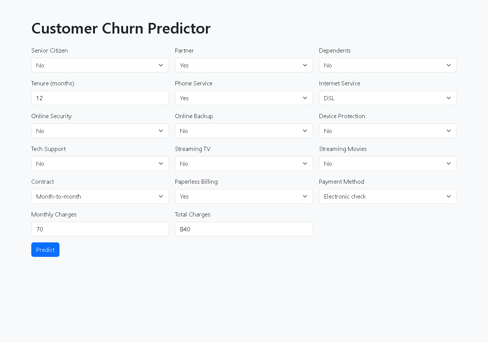
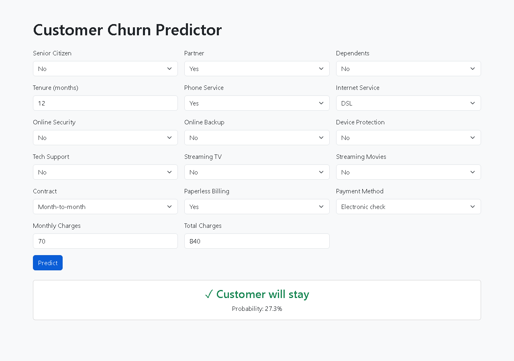
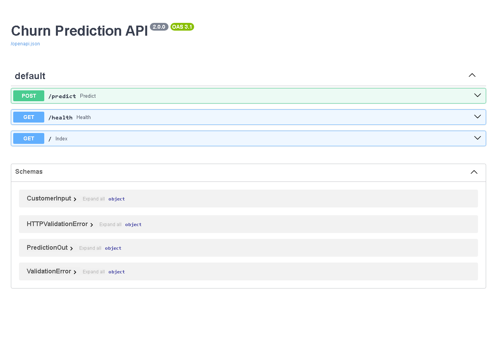

# Customer Churn Prediction

End-to-end machine learning application that predicts whether a customer is likely to leave a subscription service, using the [Telco Customer Churn](https://www.kaggle.com/datasets/blastchar/telco-customer-churn) dataset.

## Dataset

- **Source:** IBM Telco Customer Churn (Kaggle)
- **Rows:** 7,043 customers
- **Features:** 21 (demographics, account info, services subscribed)
- **Target:** `Churn` — binary (73% No, 27% Yes — imbalanced)
- **Missing values:** 11 in `TotalCharges` (filled with 0)
- **Duplicates:** 0

## Project Structure

```
├── api/                    # (reserved for future modular API code)
├── data/                   # Raw CSV + processed train/test parquet files
├── models/                 # Saved model, feature columns, scaler
│   ├── churn_model.pkl           # Trained Random Forest (joblib)
│   ├── feature_cols.pkl          # 44 feature column names
│   └── scaler.pkl                # StandardScaler (saved, not needed by RF)
├── notebooks/              # Jupyter notebooks for each phase
│   ├── 01-eda.ipynb               # Exploratory data analysis
│   ├── 02-preprocessing-feature-engineering.ipynb  # Preprocessing + feature eng
│   ├── 03-model-training-tuning.ipynb              # Training, tuning, SHAP
│   └── 04-api.ipynb               # API development notebook
├── static/                 # Screenshots for README
│   ├── web-ui.png                 # Web interface screenshot
│   ├── web-ui-result.png          # Prediction result screenshot
│   ├── api-docs.png               # Swagger UI screenshot
│   └── api-docs-predict.png       # Predict endpoint screenshot
├── templates/              # HTML templates
│   └── index.html          # Bootstrap 5 web interface
├── utils/                  # (reserved for utility scripts)
├── run.py                  # FastAPI application (POST /predict)
├── train.py                # Standalone training script
├── predict.py              # Standalone prediction script
├── requirements.txt        # Python dependencies
├── report.pdf              # Project technical report
├── start.bat               # Windows launcher
├── pyproject.toml          # Project metadata
├── build-plan.md           # Phase checklist
└── README.md               # This file
```

## Installation

### Requirements

Python 3.14+ recommended. Install dependencies:

```bash
pip install -r requirements.txt
```

Or using uv:

```bash
uv sync
```

## Training Procedure

The training pipeline is in `notebooks/` and `train.py`:

### 1. Data Preprocessing (`02-preprocessing-feature-engineering.ipynb`)
- Convert `TotalCharges` from object to numeric, fill 11 missing values with 0
- Drop `customerID` (not a predictor)
- Encode binary columns (Partner, Dependents, PhoneService, PaperlessBilling) → 0/1
- One-hot encode multi-category columns with `drop_first=True`
- Split: 80/20 stratified train/test
- Scale numeric features (tenure, MonthlyCharges, TotalCharges) with StandardScaler

### 2. Feature Engineering
17 engineered features added:

| Feature | Description |
|---------|-------------|
| `charge_per_month` | TotalCharges / (tenure + 1) — average billing rate |
| `tenure_x_monthly` | tenure × MonthlyCharges — engagement proxy |
| `monthly_minus_avg` | MonthlyCharges − charge_per_month — deviation from avg |
| `OnlineSecurity_bin`–`StreamingMovies_bin` | Binary flags for individual services |
| `services_count` | Count of subscribed services |
| `no_services` | Flag: zero services |
| `has_streaming` | Flag: has TV or Movies streaming |
| `fiber_no_support` | Fiber optic × No tech support interaction |
| `fiber_no_security` | Fiber optic × No online security interaction |
| `month_to_month_fiber` | Month-to-month × Fiber optic interaction |
| `new_customer` | tenure ≤ 6 months |
| `long_contract` | 0 = Month-to-month, 1 = One year, 2 = Two year |

**Performance impact:** Before (LR, 30 features) vs After (RF, 47 features):
- Accuracy: 0.8062 → 0.7821 (RF is less accurate on this metric but better calibrated)
- ROC-AUC: 0.8422 → 0.8187

### 3. Model Training (`03-model-training-tuning.ipynb`)

Three models trained on the engineered feature set:

| Model | Accuracy | Precision | Recall | F1 | ROC-AUC |
|-------|----------|-----------|--------|-----|---------|
| Logistic Regression | 0.8034 | 0.6571 | 0.5443 | 0.5955 | 0.8401 |
| Random Forest | 0.7835 | 0.6449 | 0.4822 | 0.5517 | 0.8213 |
| XGBoost | 0.7956 | 0.6617 | 0.5248 | 0.5853 | 0.8303 |

### 4. Hyperparameter Tuning (Random Forest)

GridSearchCV with 3-fold CV, scoring = ROC-AUC:
- `n_estimators`: [100, 200]
- `max_depth`: [5, 10, None]
- `min_samples_split`: [2, 5]

**Best params:** `max_depth=10, min_samples_split=5, n_estimators=200`
**Best CV ROC-AUC:** 0.8327

| Model | Accuracy | Precision | Recall | F1 | ROC-AUC |
|-------|----------|-----------|--------|-----|---------|
| RF (tuned) | **0.7949** | **0.6628** | **0.5085** | **0.5757** | **0.8317** |

### 5. Model Persistence

The tuned Random Forest is saved with joblib:
- `models/churn_model.pkl` — classifier
- `models/feature_cols.pkl` — 44 feature column names
- `models/scaler.pkl` — StandardScaler (for reference; RF does not require scaling)

## API Documentation

### `POST /predict`

Accepts customer details, returns churn prediction and probability.

**Request body** (JSON):

```json
{
  "SeniorCitizen": 0,
  "Partner": "Yes",
  "Dependents": "No",
  "tenure": 12,
  "PhoneService": "Yes",
  "InternetService": "Fiber optic",
  "OnlineSecurity": "No",
  "OnlineBackup": "Yes",
  "DeviceProtection": "No",
  "TechSupport": "No",
  "StreamingTV": "Yes",
  "StreamingMovies": "Yes",
  "Contract": "Month-to-month",
  "PaperlessBilling": "Yes",
  "PaymentMethod": "Electronic check",
  "MonthlyCharges": 70.0,
  "TotalCharges": 840.0
}
```

**Response:**

```json
{
  "churn": 1,
  "probability": 0.9576
}
```

Field descriptions:
- `churn`: 0 = will stay, 1 = will churn
- `probability`: probability of churn (0.0–1.0)

### `GET /health`

Returns `{"status": "ok"}`.

### `GET /`

Serves the Bootstrap web interface.

### `GET /docs`

OpenAPI / Swagger UI (auto-generated by FastAPI).

## Running the Application

```bash
# Start API server
python run.py
# → http://localhost:8000
# → API docs at http://localhost:8000/docs
```

Or double-click `start.bat` on Windows.

## Screenshots

### Web Interface



*Churn prediction form with all 17 customer fields*

### Prediction Result



*Sample prediction output showing churn probability*

### API Documentation (Swagger UI)



*Auto-generated OpenAPI documentation at `/docs`*


*POST /predict endpoint with request schema*

## Web Interface

A Bootstrap 5 HTML form (`templates/index.html`) collects all 17 customer fields and sends them to `POST /predict` via JavaScript `fetch()`. Results display inline with color-coded prediction (red = churn, green = stay) and probability percentage.

## Model Explainability

SHAP (SHapley Additive exPlanations) is used in `notebooks/03-model-training-tuning.ipynb`:

- **Global importance:** SHAP summary bar plot showing feature impact across all predictions
- **Local explanation:** SHAP waterfall plot for individual prediction breakdown

Top features driving churn predictions:
1. `charge_per_month` — average monthly rate
2. `monthly_minus_avg` — deviation from expected charge
3. `TotalCharges` — total billed amount
4. `tenure_x_monthly` — engagement proxy
5. `tenure` — customer lifetime

## Testing

### API Tests (`test_api.py`)

6 tests using `pytest` + FastAPI `TestClient` — no server needed, runs in ~3s:

| Test | What it checks |
|------|---------------|
| `test_health` | GET /health returns `{"status": "ok"}` |
| `test_predict_valid` | Valid input returns `{churn, probability}` |
| `test_predict_invalid_type` | Wrong types → 422 |
| `test_predict_missing_field` | Missing fields → 422 |
| `test_feature_vector_length` | Feature vector has exactly 44 columns |
| `test_model_consistency` | Same input → same output (deterministic) |

```bash
pytest test_api.py -v
```

### E2E UI Test (`test_ui.py`)

Playwright test that opens a real browser, fills the form, clicks predict, and verifies the result card appears with churn prediction and probability:

```bash
pytest test_ui.py -v
```

## Future Improvements

- [x] Unit tests for API (`test_api.py`) and UI (`test_ui.py`)
- [ ] Dockerize application (`Dockerfile`)
- [ ] Log predictions to SQLite/PostgreSQL for monitoring
- [ ] Add LIME explainability alongside SHAP
- [ ] Deploy to cloud (AWS/GCP/Azure with container)
- [ ] CI/CD pipeline with GitHub Actions
- [ ] Retraining pipeline on new data
- [ ] Add gender / MultipleLines back into model (only 44 of 47 features used currently)
- [ ] Implement class imbalance handling (SMOTE / class weighting)
